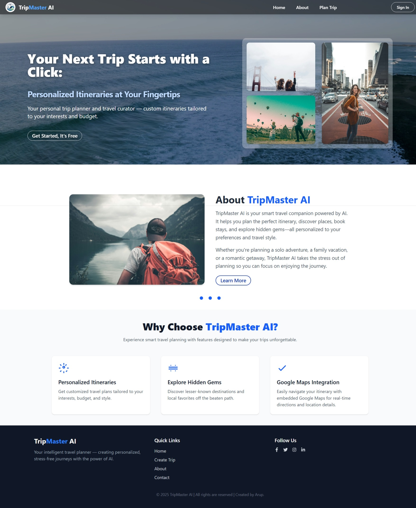

# ✈🌍 TripMaster AI

**TripMaster AI** is an intelligent, AI-driven trip planning web application that helps users create customized travel itineraries with just a few clicks. Whether you're planning a solo adventure, a romantic getaway, or a family vacation, TripMaster AI generates a full travel plan tailored to your preferences — all powered by cutting-edge AI and location data APIs.

## ✨ Features

- 🧠 **AI-Based Trip Planning** using **Google Gemini API**
- 📍 **Location Intelligence** powered by **OpenStreetMap**
- 🔐 **Secure Login** with **Google Authentication** & Data Storage with **Firebase**
- 📅 Input your **start date**, **return date**, **destination**
- 💰 Select your **budget** (Cheap, Moderate, or High)
- 🧳 Choose your **trip type** (Solo, Couple, Friends, Family)
- 📋 **Generate Detailed Itinerary** in one click
- 🕓 View and manage your **trip history**

## 🛠️ Built With

- **Frontend:** [React.js](https://reactjs.org/), [TailwindCss](https://tailwindcss.com/docs/installation/using-vite)
- **AI Backend:** [Google Gemini API](https://ai.google.dev/)
- **Maps & Location:** [OpenStreetMap](https://www.openstreetmap.org/)
- **Database:** [Firebase](https://firebase.google.com/)
- **Authentication Option:** [Google Auth](https://developers.google.com/identity)

## 🚀 Getting Started

### Prerequisites

Make sure you have the following installed:

- Node.js (v16 or above)
- npm or yarn
- tailwindcss

### Installation

1. **Clone the repository**

```bash
git clone https://github.com/your-username/tripmaster-ai.git
cd tripmaster-ai
```

2. **Install dependencies**

```bash
npm install
# or
yarn install
```

3. **Configure Environment Variables**

Create a .env file in the root and add:

```env
VITE_GOOGLE_GEMINI_API_KEY=your_google_gemini_api_key
VITE_GOOGLE_AUTH_CLIENT_ID=your_google_client_id
```

4. **Start the development server**

```bash
npm run dev
# or
yarn dev
```
Visit http://localhost:5173 in your browser.

### 🔥 Firebase Setup
- Go to Firebase Console.
- Create a new project.
- Enable Authentication → Sign-in Method → Enable Google.
- Set up Cloud Firestore for storing user data and trip history.
- Copy your Firebase config and paste it into .env as shown above.

## 📸 Screenshots

### **Home Page**


### **About Page**


### **Plan Trip**


### **My Trips**


### **View Trip**


## ✍️ Future Improvements
- Add trip sharing with friends
- Integrate hotel & flight booking APIs
- Mobile app version using React Native
- Multi-language support